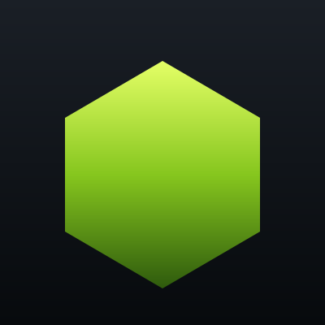

<p align="center">
  
</p>

<h1 align="center">Nodewire</h1>

<p align="center">
  A Minecraft NeoForge 1.21.1 mod that replaces redstone with a node-based logic system. Build logic visually in an in-world editor, then export it as a reusable graph — across sub-level boundaries (Sable) and alongside Create + Create Aeronautics.
</p>

<p align="center">
  
  
  
  
  
  
</p>

> **Branch note.** `master` is the Forge 1.20.1 release (v0.1.x). The active branch [`port/neoforge-1.21.1`](https://github.com/nitkanikita21/nodewire/tree/port/neoforge-1.21.1) is the NeoForge 1.21.1 port (v0.2.0-dev) — what this README describes. Compiles + tests pass; in-client smoke testing in progress. Dev builds are published as GitHub pre-releases when a `dev-v*` tag is pushed.

## Features

- **Visual node editor** opened on a placed Nodewire block. Pan, zoom, drag nodes, draw wires.
- **Unified selection model** — nodes, groups, and comments share the same press / drag / marquee / Del / accent-border logic. Marquee selects all three kinds; drag on a selected item moves the whole selection (including group members and nested sub-groups) in one undoable step.
- **Save & load graphs** to client-side files (`<gamedir>/nodewire-graphs/<name>.snbt`) and reuse them between worlds.
- **Node groups** — collapse parts of a graph into a reusable subgraph. Groups can be nested, saved as standalone templates, renamed inline (double-LMB), and live-synced when you edit the master template.
- **Comments + wire labels** — annotate the editor with floating text boxes and label individual wires for legibility.
- **Cross-sub-level logic** — designed to function across Sable sub-level boundaries (e.g., Aeronautics aircraft). Sable Companion provides safe no-op defaults so the mod runs without Sable installed.
- **Create-friendly** — works alongside Create 6.0.10 + Ponder + Flywheel. Reads/writes Create wireless-redstone frequencies.
- **Create Aeronautics integration** — `Aeronautics Input` node binds to per-block state (propeller RPM, burner signal, vent pressure, …) across ~33 channels on 7 block kinds.
- **Tweaked Controllers integration** — `Controller Input` node binds gamepad axes/buttons to graph signals.

## Stack

- Minecraft **1.21.1** + NeoForge **21.1.230**
- Kotlin **2.0.20** + Kotlin for Forge (NeoForge) **5.5.0**
- Build plugin: **`net.neoforged.moddev` 2.0.141** (ModDevGradle, non-legacy)
- Java toolchain: **21**
- Custom UI framework on top of **Compose runtime 1.7.0** (no Skiko, no AWT) + **Yoga** (AppliedEnergistics fork, rebuilt for Java 21)
- Integrations: Sable (via Sable Companion), Create 6.0.10, Create Aeronautics 1.2.1, Tweaked Controllers 1.2.7, JEI, EMI

## Build

```bash
./gradlew build      # compile + reobf, ~30s incremental
./gradlew test       # unit tests — run locally before pushing
```

> **CI note:** GitHub Actions runs `./gradlew build -x test` only. ModDevGradle's class remap doesn't refresh the SHA-384 digests in `META-INF/MANIFEST.MF`, and JarVerifier on a fresh CI cache rejects test discovery. Locally this is a non-issue.

ModDevGradle generates IDE run configurations automatically on Gradle sync — re-import the project in IntelliJ after editing `build.gradle.kts`. No manual `genIntellijRuns`.

The bundled `libs/yoga-1.0.0-j17.jar` is included so the project builds out of the box (the name is historical — Java 17 bytecode runs on the JDK 21 toolchain unchanged). To rebuild it yourself see [`docs/yoga-rebuild.md`](docs/yoga-rebuild.md).

## In-game

1. Launch the client (`./gradlew runClient` or via IntelliJ).
2. Enter a world.
3. Place the Nodewire block and right-click it to open the editor.

See [`docs/usage.md`](docs/usage.md) for the editing workflow, keybinds, node categories, and mod-integration details.

## Project layout

```
src/main/kotlin/dev/nitka/nodewire/
├── Nodewire.kt                 # @Mod entrypoint
├── Registry.kt                 # DeferredRegister for blocks/items/BEs
├── JpmsBridge.kt               # runtime kotlin.stdlib -> kotlinx.coroutines.core add_reads
├── client/
│   ├── NodewireClient.kt       # client init, keybinds
│   └── screen/                 # node editor screens, layers, dialogs
├── graph/                      # graph model: Node, Edge, NodeGraph, Group, Comment, codecs
├── net/                        # CustomPacketPayload-based network layer
├── integration/
│   ├── sable/                  # SableSubLevelBackend (replaces VS2)
│   ├── aeronautics/            # AeroChannel pipeline + AeroInput node
│   ├── create/                 # redstone-link IO nodes
│   └── tweakedcontroller/      # ControllerInput node
└── ui/                         # custom Compose runtime UI framework
    ├── core/                   # Applier, dispatcher, owner, YogaNode wiring
    ├── components/             # Text, TextInput, TextArea, Button, Surface, etc.
    ├── modifier/               # Modifier elements (layout / style / input)
    └── render/                 # NwCanvas + render walk
```

Architectural details (UI framework layering, JPMS bridge, gotchas) live in [`CLAUDE.md`](CLAUDE.md). Port status and per-phase work log in [`MIGRATION_STATUS.md`](MIGRATION_STATUS.md).

## Contributing

This project is in early development. If you'd like to contribute:

1. Open an issue first to discuss the change.
2. Match existing patterns — look at neighbouring files before introducing new abstractions.
3. Add unit tests where reasonable; the existing test suite (under `src/test/kotlin`) covers graph codecs, group operations, proxy-pin labeling, and the Aeronautics channel catalog.

## License

[MIT](LICENSE) © 2026 nitka
